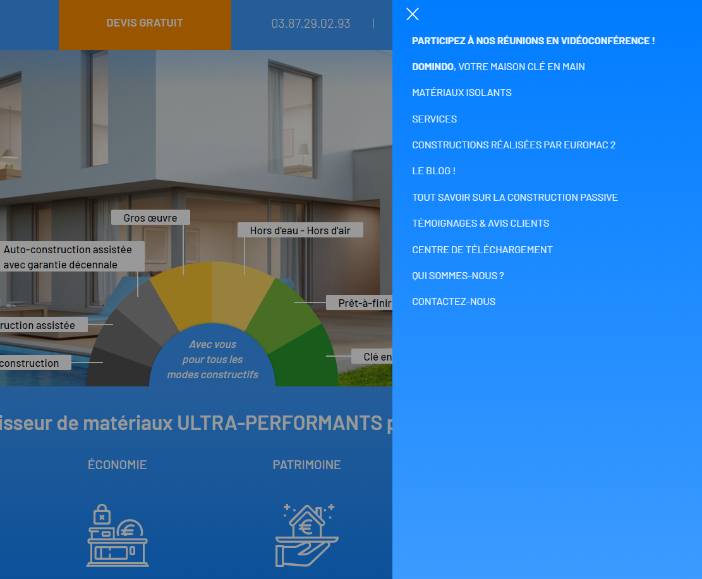

# Test d'intégration Advisa

Dans le cadre de ce test, vous devez intégrer la maquette intitulée **home.jpg**. Il s'agit de la version desktop, mais aujourd'hui tout doit être en responsive. De ce fait, il faut veiller à ce que celle-ci s'adapte en version tablette et mobile.

Le but de ce test est d'évaluer votre capacité à trouver des solutions plus ou moins rapides afin d'obtenir un résultat visuel se rapprochant le plus de la maquette. Ce n'est pas grave si vous bloquez sur certaine partie du test. Du moment que vous avez eu et pris l'initiative de chercher des solutions afin de les mettre en oeuvres.

## Un menu mobile
Étant donné que l'intégration doit être faite en responsive, il vous est demandé de réaliser un menu s'adaptant aux tablettes et mobiles. Pour ce faire, il faudra rendre le menu horizontal, en vertical à droite qui sera visible uniquement au clic sur un bouton MENU. Pour le masquer, il faudra cliquer sur un bouton FERMER.

Voici un exemple du type de menu mobile attendu :
 

## Quelques indications de style
Typographie des titres : `Crimson`  
Typographie des textes : `Lato`  
Couleur or utilisée : `#b1a779`  
Couleur gris des titres : `#dbdbdb`  
Couleur gris clair : `#f3f3f3`  
Fond transparent foncé sur l'image de présentation : `rgba(0,0,0,0.37)`  
Fond transparent clair sur l'image de présentation : `rgba(255,255,255,0.27)`  

### Les contraintes du projet en CSS
Pour ce projet, vous pouvez faire vos feuilles de styles en css mais il est préférable d'utiliser le preprocess SASS pour générer votre/vos feuille(s) de style(s).

Vous pouvez également utiliser n'importe quelle bibliothèque CSS pour vous permettre d'atteindre l'objectif visuel souhaité.

### Les contraintes du projet JS
Vous pouvez utilser du javascript ou du jQuery si vous estimez en avoir besoin pour rendre dynamique le menu en mobile.

De même qu'en CSS, vous pouvez utiliser les bibliothèques JS que vous jugerez nécessaires.
